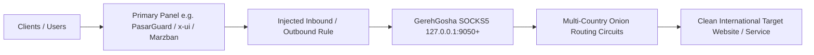

<div align="center">

# 🌐 Tutorial Language / زبان آموزش / Язык руководства / 教程语言

**English** • [فارسی](TUTORIAL_FA.md) • [Русский](TUTORIAL_RU.md) • [简体中文](TUTORIAL_ZH.md)

---

# 📖 GerehGosha (گره‌گشا) · Step-by-Step Usage Guide & Tutorial

**How to Discover Multi-Country Exits and Inject Them into Upstream Panels**

[Back to Main README](README.md)

</div>

---

## 📌 Introduction & Architecture Recap

GerehGosha is designed to act as a resilient multi-country outbound bridge for your primary proxy panels.



---

## 🛠️ Step 1: Initial Setup & Access

1. Ensure GerehGosha is installed on your server (via `sudo bash install.sh`).
2. Log in to the Unified Dashboard at `http://YOUR_SERVER_IP:5000`.
3. If this is your first login, select your preferred language (English, Persian, Russian, or Chinese).

---

## 🌍 Step 2: Discovering & Activating Countries

1. Navigate to the **Engine & Exits** section in the dashboard.
2. Click **Start Discovery** or **Scan Network** to let the engine detect active international relays.
3. Select the desired destination countries (e.g., US, Germany, Netherlands).
4. Note down the assigned local SOCKS5 ports (starting from `9050`).

---

## 💉 Step 3: Injecting Outbounds into PasarGuard

1. Open your PasarGuard admin panel and obtain your **Admin Token** (or use `gerehgosha` CLI option 7: *Fetch Pasarguard Token*).
2. Enter your PasarGuard host, port, and token into GerehGosha's Injection settings.
3. Click **Inject All Selected Locations**.
4. GerehGosha will automatically:
   - Create corresponding Inbounds for each country.
   - Attach the local SOCKS5 endpoint to each inbound.
   - Configure tags and routing rules.

---

## 🔄 Step 4: Circuit Health & New IP Rotation

- If a specific location experiences slowdowns or latency spikes:
  - Click the **New IP** button next to the country card in the dashboard.
  - GerehGosha immediately rebuilds the circuit with a fresh exit relay and a new international IP address.

---

## 💡 Troubleshooting & FAQs

- **Checking Local Ports:**  
  Verify that ports `9050`, `9051`, etc. are listening:
  ```bash
  curl -x socks5h://127.0.0.1:9050 https://api.ipify.org
  ```
- **Live Logs:**  
  ```bash
  journalctl -u tor-checker.service -f
  ```

---

*(This tutorial template is ready for further custom guides and screenshots).*
