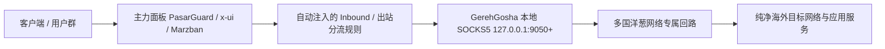

<div align="center">

# 🌐 Tutorial Language / زبان آموزش / Язык руководства / 教程语言

[English](TUTORIAL.md) • [فارسی](TUTORIAL_FA.md) • [Русский](TUTORIAL_RU.md) • **简体中文**

---

# 📖 GerehGosha (گره‌گشا) · 详细实战使用教程与指南

**如何建立多国家出口并无缝注入到上游代理面板**

[返回主 README](README_ZH.md)

</div>

---

## 📌 架构与运行逻辑回顾

GerehGosha 作为一个高可用的海外多国出口网桥，与您的主力面板协同工作：



---

## 🛠️ 第一步：环境就绪与初始访问

1. 确认服务器已成功执行安装程序（`sudo bash install.sh`）。
2. 在浏览器打开统一网关控制台：`http://服务器IP:5000`。
3. 首次登录请选择您的首选显示语言（支持英文、波斯语、俄语、简体中文）。

---

## 🌍 第二步：扫描探测与国家回路激活

1. 进入仪表盘中的 **Engine / 出口管理** 区域。
2. 点击 **Start Discovery（启动探测）**，引擎将全自动甄选低延迟、高带宽的海外中继。
3. 勾选需要激活的目标国家（例如美国、德国、荷兰等）。
4. 记下为每个国家分配的独立本地 SOCKS5 端口（自 `9050` 起递增）。

---

## 💉 第三步：一键直连注入 PasarGuard 面板

1. 获取您的 PasarGuard 管理员 API Token（或在服务器输入 `gerehgosha` 命令并选择选项 7 提取）。
2. 在 GerehGosha 的 **注入设置** 中填入 PasarGuard 的 IP、端口和 Token。
3. 点击 **Inject All Selected Locations（一键注入所有地区）**。
4. GerehGosha 会自动完成：
   - 为每个国家创建对应专属 Inbound。
   - 绑定对应的本地 SOCKS5 出口回路。
   - 配置标签与分流策略，直接可在客户端节点配置中使用。

---

## 🔄 第四步：链路健康监测与秒切新 IP（New IP）

- 若某个国家节点出现网络波动或速率减缓：
  - 点击对应国家卡片上的 **New IP** 按钮。
  - 引擎将在毫秒级重构回路，并自动分配全新的海外纯净 IP。

---

## 💡 常用排查命令与技巧

- **验证本地 SOCKS5 端口通信：**
  ```bash
  curl -x socks5h://127.0.0.1:9050 https://api.ipify.org
  ```
- **查看核心引擎实时运行日志：**
  ```bash
  journalctl -u tor-checker.service -f
  ```

---

*(本教程骨架已就绪，方便您后续根据需要进一步扩充个性化图文与配置细节)。*
