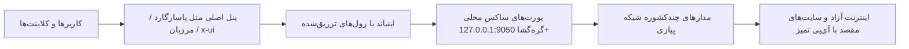

<div align="center">

# 🌐 Tutorial Language / زبان آموزش / Язык руководства / 教程语言

[English](../TUTORIAL.md) • **فارسی** • [Русский](TUTORIAL_RU.md) • [简体中文](TUTORIAL_ZH.md)

---

# 📖 گره‌گشا (GerehGosha) · راهنمای مرحله‌به‌مرحله و خودمانی

**آموزش راه‌اندازی لوکیشن‌های چندکشوره و تزریق خروجی‌ها به پنل پاسارگارد**

[برگشت به صفحه اصلی README](README_FA.md)

</div>

---

## 📌 معماری و ماجرای کار گره‌گشا

گره‌گشا قراره به عنوان یه پل خروجی امن و تمیز در کنار پنل اصلی شما کار کنه:



---

## 🛠️ مرحله ۱: ورود و تنظیمات اولیه

۱. مطمئن بشید گره‌گشا روی سرور نصب شده (با همون دستور تک‌خطی یا `sudo bash install.sh`).
۲. از طریق مرورگر به آدرس `http://SERVER_IP:5000` برید.
۳. توی اولین ورود، زبانی که باهاش راحت‌ترید رو انتخاب کنید (فارسی، انگلیسی، روسی یا چینی).

---

## 🌍 مرحله ۲: اسکن شبکه و انتخاب لوکیشن‌ها

۱. داخل پنل وب برید به بخش مدیریت انجین.
۲. روی دکمه شروع اسکن بزنید تا رله‌های سریع و کم‌پینگ پیدا بشن.
۳. کشورهای مورد نظرتون (مثلاً آمریکا، آلمان، هلند و...) رو تیک بزنید و فعال کنید.
۴. پورت ساکس اختصاصی هر کشور (از `9050` به بعد) توی پنل مشخص میشه.

---

## 💉 مرحله ۳: تزریق خودکار به پاسارگارد (PasarGuard)

۱. توکن ادمین پنل پاسارگاردتون رو بردارید (یا با زدن گزینه ۷ توی دستور `gerehgosha` در سرور، راحت بگیریدش).
۲. آدرس و توکن پاسارگارد رو توی فرم تزریق گره‌گشا وارد کنید.
۳. روی دکمه **تزریق همه لوکیشن‌ها** کلیک کنید.
۴. گره‌گشا خودش همه‌چیز رو انجام میده:
   - اینباندهای متناظر با هر کشور ساخته میشه.
   - پورت‌های ساکس داخلی بهش وصل میشه.
   - تگ‌ها و روتینگ آماده میشه تا توی کانفیگ‌های کاربرا به عنوان خروجی قرار بگیره.

---

## 🔄 مرحله ۴: گرفتن آی‌پی جدید (New IP)

- اگه دیدید یه لوکیشن سرعتش افت کرده یا افت کیفیت داره:
  - کافیه دکمه‌ی **New IP** کنار همون کشور رو بزنید.
  - بلافاصله مدار اون کشور بازسازی میشه و یه آی‌پی تمیز و جدید بهش تعلق می‌گیره.

---

## 💡 چند تا دستور به‌دردبخور برای چک کردن وضعیت

- **تست سلامت پورت ساکس محلی:**
  ```bash
  curl -x socks5h://127.0.0.1:9050 https://api.ipify.org
  ```
- **دیدن لاگ زنده موتور تور:**
  ```bash
  journalctl -u tor-checker.service -f
  ```

---

*(این فایل به عنوان یه چارچوب آماده و مرتب در اختیارتونه تا هر وقت خواستید تصاویر و توضیحات بیشتری هم بهش اضافه کنید).*
