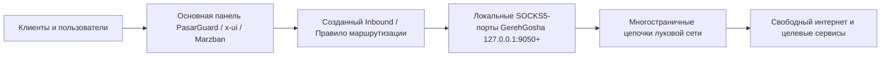

<div align="center">

# 🌐 Tutorial Language / زبان آموزش / Язык руководства / 教程语言

[English](../TUTORIAL.md) • [فارسی](TUTORIAL_FA.md) • **Русский** • [简体中文](TUTORIAL_ZH.md)

---

# 📖 GerehGosha (گره‌گشا) · Пошаговое руководство и туториал

**Как настроить многостраничные выходы и выполнить инъекцию в панели**

[Вернуться к основному README](README_RU.md)

</div>

---

## 📌 Архитектура и принцип работы

GerehGosha выступает в качестве надежного исходящего моста для ваших основных панелей управления:



---

## 🛠️ Шаг 1: Первичная настройка и доступ

1. Убедитесь, что GerehGosha установлена на сервере (`sudo bash install.sh`).
2. Войдите в единую веб-панель по адресу `http://IP_СЕРВЕРА:5000`.
3. При первом входе выберите предпочтительный язык интерфейса.

---

## 🌍 Шаг 2: Сканирование и выбор локаций

1. Перейдите в раздел управления движком в веб-интерфейсе.
2. Запустите сетевое сканирование для нахождения низколатентных реле.
3. Активируйте желаемые страны (США, Германия, Нидерланды и т.д.).
4. Обратите внимание на назначенные локальные порты SOCKS5 (начиная с `9050`).

---

## 💉 Шаг 3: Инъекция шлюзов в PasarGuard

1. Получите токен администратора PasarGuard (или используйте пункт 7 команды `gerehgosha` на сервере).
2. Укажите адрес и токен PasarGuard в настройках инъекции GerehGosha.
3. Нажмите кнопку **Inject All Selected Locations** (Инъекция выбранных локаций).
4. GerehGosha автоматически:
   - Создаст соответствующие Inbound-порты для каждой страны.
   - Подключит локальные SOCKS5-шлюзы.
   - Настроит теги и правила для использования в конфигурациях клиентов.

---

## 🔄 Шаг 4: Ротация и получение нового IP (New IP)

- В случае падения скорости на определенной локации:
  - Нажмите кнопку **New IP** напротив карточки нужной страны.
  - Движок мгновенно перестроит цепочку и выдаст новый зарубежный IP-адрес.

---

## 💡 Диагностика и полезные команды

- **Проверка локальных SOCKS5-портов:**
  ```bash
  curl -x socks5h://127.0.0.1:9050 https://api.ipify.org
  ```
- **Просмотр логов движка в реальном времени:**
  ```bash
  journalctl -u tor-checker.service -f
  ```

---

*(Данный шаблон готов для дальнейшего расширения пользовательских инструкций и скриншотов).*
